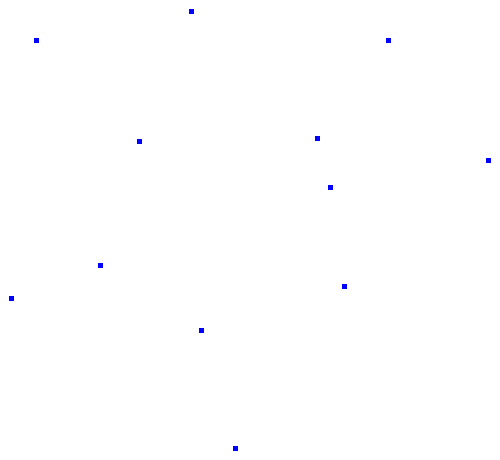
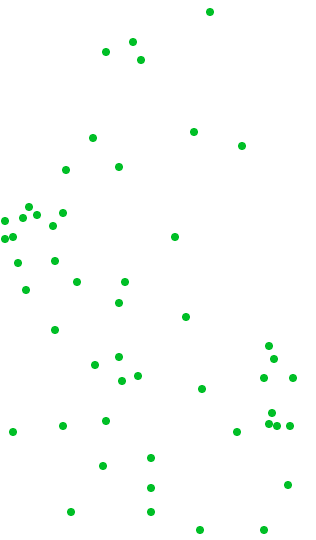
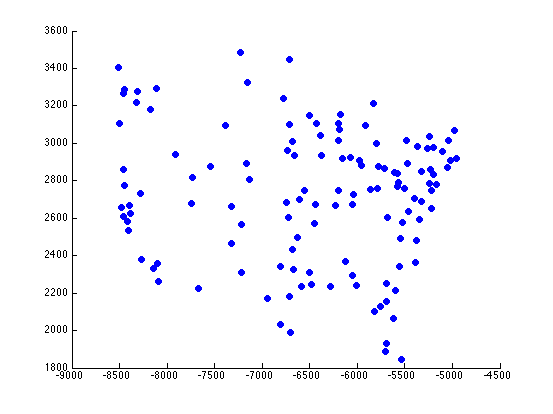

T3: Simulando a detecção de comunidades em redes através de MST's (classificação não supervisionada)
====================================================================================================

O programa deve ler um grafo ponderado de arquivo (txt, graphml, gml, ...) e a partir de um algoritmo para 
encontrar uma Minimum Spanning Tree (Kruskal ou Prim), o objetivo consiste em encontrar grupos ou "comunidades" 
no grafo de modo a agrupar regiões similares.

###METODOLOGIA
---------------

A identificação dos grupos ou comunidades será realizada da seguinte forma: primeiramente computa-se 
uma MST do grafo G = (V, E) em questão. De posse da MST, a forma mais trivial de obter grupos ou comunidades 
consiste em isolar conjuntos de vértices através da remoção de arestas da MST. Neste trabalho, o critério a ser 
utilizado é a remoção da maior aresta da MST no caso de 2 grupos. Para obter 3 grupos, deve-se remover as 
2 maiores arestas da MST e assim sucessivamente de modo que para se obter K grupos deve-se remover as 
K-1 maiores arestas da MST.

OBS: Em todos os casos nesse projeto, as matrizes de adjacência representam grafos completos.

###QUESTIONAMENTOS
------------------

<ol type="a" start="1">
    <li>Considerando o grafo a seguir de 12 vértices, mostre os resultados obtidos para:</li>
    <ol type="i">
        <li>2 grupos</li>
        <li>3 grupos</li>
    </ol>
</ol>

[Matriz de adjacência com as distâncias entre os pontos para o grafo de 12 vértices]
(http://people.sc.fsu.edu/~jburkardt/datasets/cities/uk12_dist.txt)

[Nomes dos vértices (cidades da Inglaterra)]
(http://people.sc.fsu.edu/~jburkardt/datasets/cities/uk12_name.txt)

<ol type="a" start="2">
    <li>Considerando o grafo a seguir de 59 vértices, mostre os resultados obtidos para:</li>
    <ol type="i">
        <li>3 grupos</li>
        <li>4 grupos</li>
    </ol>
</ol>

[Matriz de adjacência com as distâncias entre os pontos para o grafo de 59 vértices]
(http://people.sc.fsu.edu/~jburkardt/datasets/cities/wg59_dist.txt)
[Nomes dos vértices (cidades da Alemanha)](http://people.sc.fsu.edu/~jburkardt/datasets/cities/wg59_name.txt)

<ol type="a" start="3">
    <li>Considerando o grafo a seguir de 128 vértices, mostre os resultados obtidos para:</li>
    <ol type="i">
        <li>4 grupos</li>
        <li>5 grupos</li>
    </ol>
</ol>

[Matriz de adjacência com as distâncias entre os pontos para o grafo de 128 vértices]
(http://people.sc.fsu.edu/~jburkardt/datasets/cities/sgb128_dist.txt)
[Nomes dos vértices (cidades dos EUA)]
(http://people.sc.fsu.edu/~jburkardt/datasets/cities/sgb128_name.txt)

####OBS: 

* Utilize alguma ferramenta para plotar os grupos como conjunto de árvores em cada caso de modo que 
seja possível visualizar o resultado obtido.

* Para leitura de matrizes de adjacência gravadas em arquivo texto os comandos em Python do script a seguir mostram 
como montar uma lista de arestas a partir do arquivo .txt: 
[Lendo matrizes de adjacência com Python](http://www.moodle.ufscar.br/file.php/1619/Projetos/le_matriz_adjacencia.txt), 
Numpy e NetworkX ou 
[http://stackoverflow.com/questions/15283803/read-in-matrix-from-file-make-edgelist-and-write-edgelist-to-file]
(http://stackoverflow.com/questions/15283803/read-in-matrix-from-file-make-edgelist-and-write-edgelist-to-file)