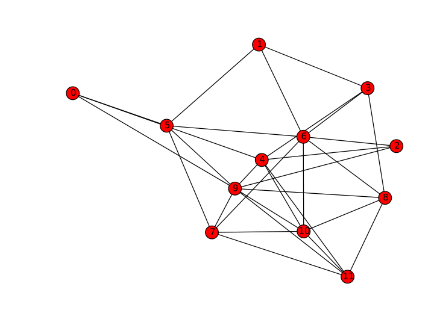
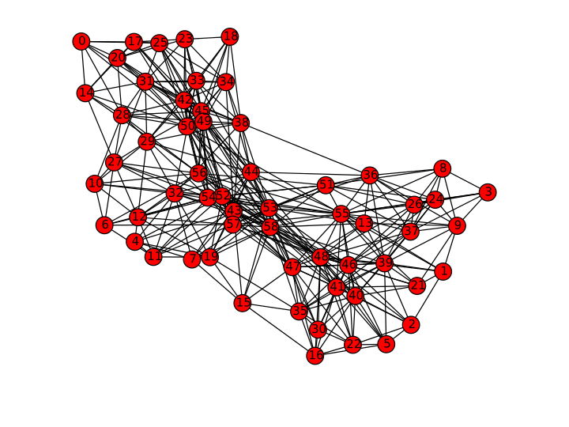
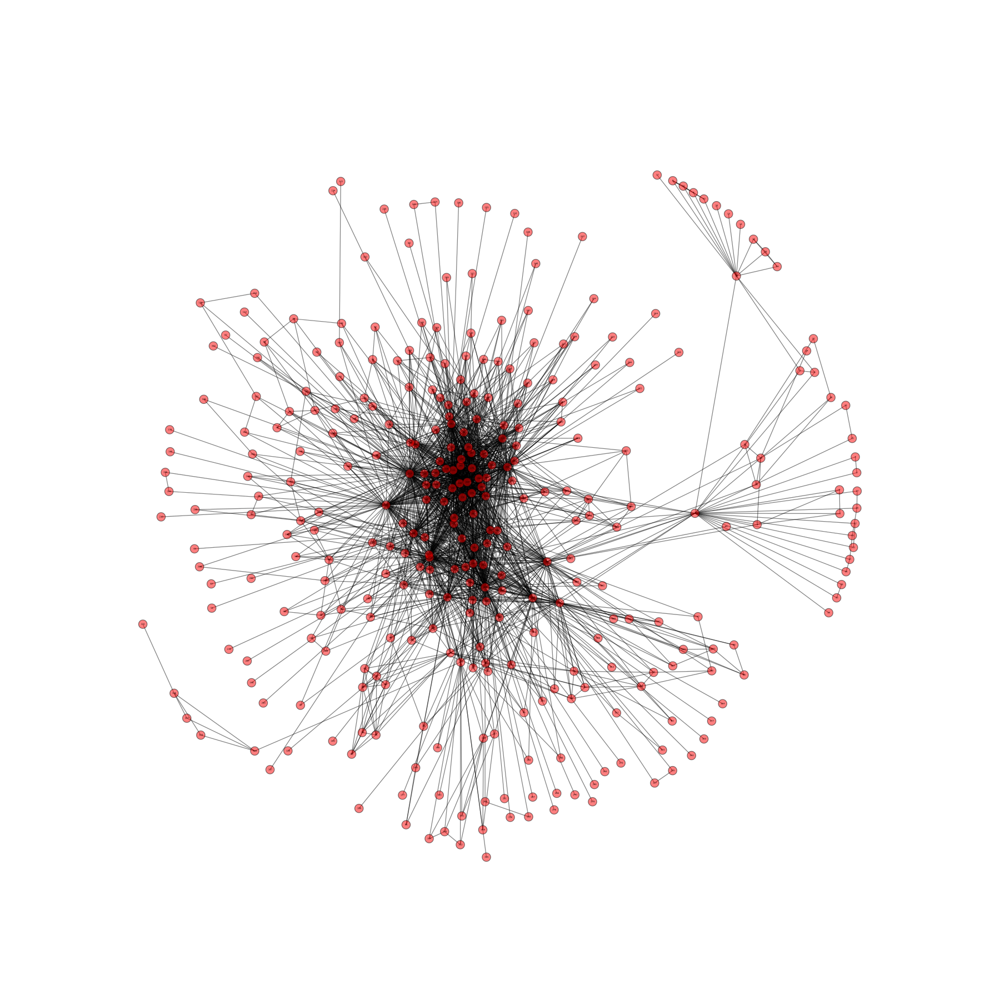

T4: Simulando reconhecimento de padrões através de caminhos ótimos em grafos (classificação supervisionada)
==========================================================================================================

O programa deve ler um grafo **ponderado** de um arquivo (txt, graphml, gml, ...) e através do 
algoritmo de Dijkstra (com várias fontes) encontrar grupos nos dados a partir do crescimentos 
de K árvores com sementes definidas inicialmente.

METODOLOGIA

Para um problema de classificação em K grupos ou comunidades, deve-se definir K sementes iniciais 
para o algoritmo (uma para cada grupo). Isso é feito zerando o custo inicial de mais de um vértice 
(várias fontes). Cada semente deve ser escolhida como sendo o protótipo representativo da região em 
questão (ao se definir de onde o crescimento de cada árvore deve começar estamos embutindo supervisão 
ao método). Dessa forma, o resultado final do agrupamento depende muito da forma com que as sementes 
são definidas, ou seja, diferentes sementes podem produzir resultados bastante distintos. 
Um processo de competição entre as sementes irá ocorrer, sendo que cada vértice do grafo ao final será 
conquistado pela semente que lhe oferecer o menor caminho.

*OBS*: Note que os grafos a seguir não são completos como no projeto das MST's. 

QUESTIONAMENTOS

Considerando o grafo a seguir de 12 vértices, mostre os resultados obtidos para:
<ol type="a">
    <li>2 agrupamentos (K = 2) com sementes espalhadas (distantes uma da outra)</li>
    <li>2 agrupamentos (K = 2) com sementes próximas uma da outra</li>
</ol>

[Matriz de adjacência com as distâncias entre os pontos para o grafo de 12 vértices]
(data/uk12distB.txt)

[Nomes dos vértices (cidades da Inglaterra)]
(data/uk12_name.txt)

Considerando o grafo a seguir de 59 vértices, mostre os resultados obtidos para:
<ol type="a">
    <li>3 agrupamentos (K = 3) com sementes espalhadas (distantes uma da outra)</li>
    <li>3 agrupamentos (K = 3) com sementes próximas uma da outra</li>
</ol>

[Matriz de adjacência com as distâncias entre os pontos para o grafo de 59 vértices]
(data/wg59distB.txt)

[Nomes dos vértices (cidades da Alemanha)]
(data/wg59distB.txt)

Considerando o grafo a seguir de 332 vértices (rede de aeroportos dos EUA), mostre os resultados obtidos para:
<ol type="a">
    <li>5 agrupamentos (K = 5) com sementes espalhadas (distantes uma da outra)</li>
    <li>5 agrupamentos (K = 5) com sementes próximas uma da outra</li>
</ol>

[Matriz de adjacência com as distâncias entre os pontos para o grafo de 332 vértices]
(data/USAir97.txt)

[Nomes dos vértices (cidades dos EUA)]
(data/USAir_names.txt)

Analise os grupos obtidos em termos da extensão de cada um deles, discutindo a variabilidade dos tamanhos dos grupos em cada caso.
